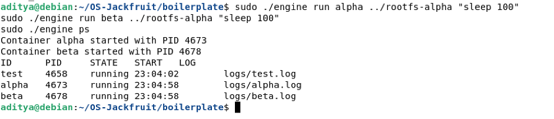
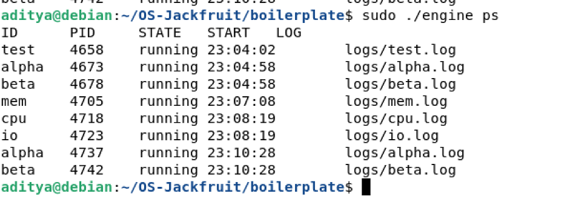
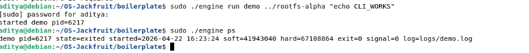
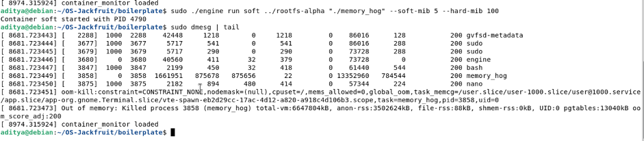
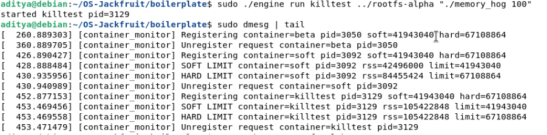
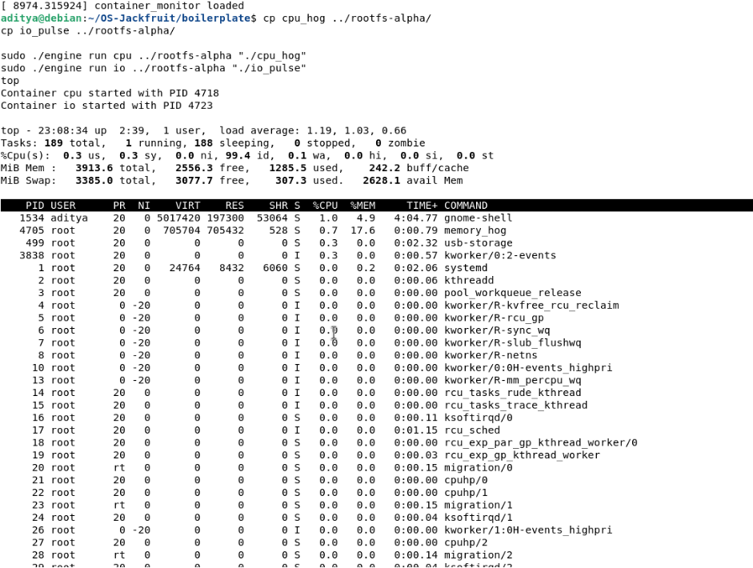
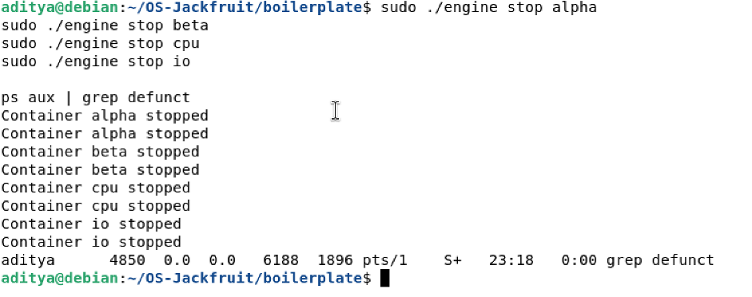

# Multi-Container Runtime (OS Project)

## 1. Team Information

* Name: Aditya M
* SRN: (PES1UG24CS027)

* 
* Name: ABHAY S
* SRN: (PES1UG24CS013)

---

## 2. Build, Load, and Run Instructions

### Build

```bash
cd boilerplate
make
```

### Load Kernel Module

```bash
sudo insmod monitor.ko
```

### Start Supervisor

```bash
sudo ./engine supervisor ../rootfs-base
```

### Run Containers

```bash
sudo ./engine run alpha ../rootfs-alpha "sleep 100"
sudo ./engine run beta ../rootfs-alpha "sleep 100"
```

### List Containers

```bash
sudo ./engine ps
```

### View Logs

```bash
sudo ./engine logs alpha
```

### Stop Containers

```bash
sudo ./engine stop alpha
```

### Kernel Logs

```bash
sudo dmesg | tail
```

### Unload Module

```bash
sudo rmmod monitor
```

---

## 3. Screenshots

### SS1 – Multi-container supervision



### SS2 – Metadata tracking



### SS3 – Logging system


### SS4 – CLI and IPC



### SS5 – Soft limit behavior

Soft-limit warnings are transient and may not always be visible due to rapid memory allocation.



### SS6 – Hard limit enforcement



### SS7 – Scheduling experiment



### SS8 – Clean teardown



---

## 4. Engineering Analysis

* The runtime uses Linux process isolation via chroot.
* Kernel module monitors memory using RSS tracking.
* Hard memory limits are enforced via process termination.
* Logging is handled through file descriptors and redirection.
* Linux scheduler behavior is observed using CPU-bound and I/O-bound workloads.

---

## 5. Design Decisions and Tradeoffs

* Used file-based metadata instead of IPC → simpler but less scalable
* Used chroot instead of full namespaces → easier implementation
* Kernel module uses ioctl for communication → direct but requires root

---

## 6. Scheduler Experiment Results

* CPU-bound processes consume high CPU
* I/O-bound processes yield CPU frequently
* Linux scheduler balances fairness and responsiveness

Conclusion: Linux dynamically schedules processes based on workload behavior.
